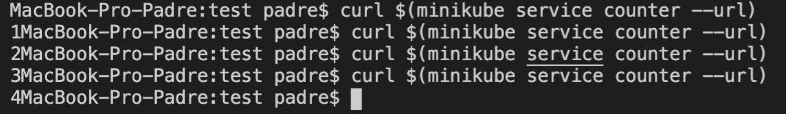
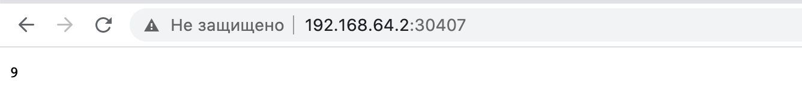

# Реализация запуска приложения в Kubernetes

#### Задание
Необходимо реализовать запуск приложение в Kubernetes с использованием облачного провайдера. В исключительных случаях можно запустить Kubernetes локально.

#### Реализация

##### Для начала нужно установить необходимое ПО:
**Minikube** - утилита командной строки для настройки и запуска однонодового кластера Kubernetes в виртуальной машине на локальном компьютере.

Установка minikube
```
brew install minikube
```
**Kubectl** — это инструмент командной строки для управления кластерами Kubernetes.
Установка kubectl
```
brew install kubectl
```
##### Запуск 
Запуск minikube
```
minikube start
```
Запуск веб-панели
```
minikube dashboard
```
Настроим среду для использования демона Docker minikube
```
eval $(minikube docker-env)
```

При создании образа использовался простой счетчик, написанный на Node.js и создан Dockerfile.
```
docker build -t server .
```
Создадим Deployment
```
kubectl create deployment counter --image=server
```
**Deployment** в Kubernetes проверяет здоровье пода и перезагружает контейнер пода в случае его отказа. Deployment-ы являются рекомендуемым способом организации создания и масштабирования подов.
Команда minikube docker-env возвращает набор экспортируемых переменных среды Bash, чтобы настроить локальную среду для повторного использования демона Docker внутри экземпляра Minikube.

Сделать под доступным для публичной сети Интернет можно с помощью команды `kubectl expose`
```
kubectl expose deployment counter --type=NodePort --port=8080
```
Получение списка deployment
```
kubectl get deployments
```
Получение списка подов
```
kubectl get pods
```
получение список сервисов
```
kubectl get services
```
Сделаем проверку при помощи следующей команды:
```
curl $(minikube service counter --url)
```
Видим, что все работает


Смотрим доступность в браузере
```
minikube service counter --url
http://192.168.64.2:30407
```



